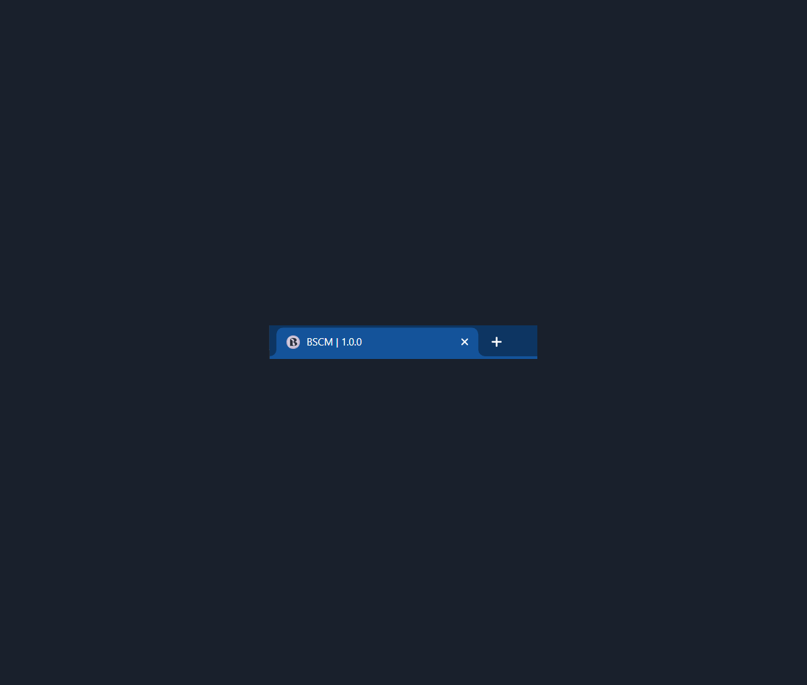

# A Blockchain Based Supply Chain Management System

## Hardhat Migration
In light of Truffle and Ganache's sunset, the project has been migrated to Hardhat. The old Truffle code  can be accessed from the `truffle_version` branch in this repository.

## Dependencies
Built upon the [Hardhat boilerplate code](https://github.com/NomicFoundation/hardhat-boilerplate), which helps integrate ReactJs with blockchain smart contracts.

Tools and versions used -

- Node v20.12.0
- npm v10.5.0
- Hardhat v2.12.5
- Ethers v5.4.7
- Solidity v0.8.17
- MUI v5.15.20

## Code Structure
The ReactJs part of the code goes under `appfrontend`, smart contracts under `contracts`, and deployment configurations for these smart contracts under `scripts`.

Frontend uses the compiled contracts to interact with them. The compiled contracts are stored in `appfrontend/src/contracts/` (as configured in the `deploy.js` file) and are accessed directly from the `.json` files.

Frontend images for current state of the application are stored in the `images/currentstate` folder.

To know more about what's part of the frontend code, check out the README file in `appfrontend/`. 

## Getting Started

### Install the Required Dependencies

- Clone the project and run `npm install` in both the root and `appfrontend` folders. This should install all of the required dependencies.
- Get the MetaMask browser extension. Create a test network that points to the local Hardhat network (http://127.0.0.1:8545/), import the Hardhat accounts into MetaMask and use them to access the application. Without MetaMask, the application asks users to download wallet extensions like [Coinbase](https://www.coinbase.com/wallet) or [Metamask](https://metamask.io).

### Configure the Project

- Open up the console in the root project directory and run a new local Hardhat network with `npx hardhat node` to work on a local chain.
- Use Hardhat commands `npx hardhat compile` to compile the smart contracts, and `npx hardhat run scripts/deploy.js --network localhost` to deploy specifically to the `localhost` environment.
- If updating any folder names in the frontend code, please note that the path for storing the compiled contracts might need to be modified in the `scripts/deploy.js` file.
- The migrations should successfully go through and the local Hardhat node should be updated with the contract deployment details.
 
For more commands, please refer to Hardhat's [guides and tutorials](https://hardhat.org/tutorial).

### Get the Frontend Running
Navigate to the `appfrontend` folder and run `npm start`. This should start the application and open it up in `localhost:3000`. Register with one of the MetaMask accounts as either a producer, distributor, or a retailer. 

 

## Current Functionalities
Currently integrates with the available wallet address to carry out these functionalities and works only for one producer, distributor and retailer user accounts.

In general, users can -
- update the status of batches,
- view their basic profile details,
- view the batch details after creation,
- view active and sold (history) batches and their details.

Producers can create batches of products and the rest of the users can buy and sell them.

## Enhancements
Please check the repository's project board for ongoing and future enhancements.

## Target State

### Supply Chain Flow 

 

### User Actions

 

